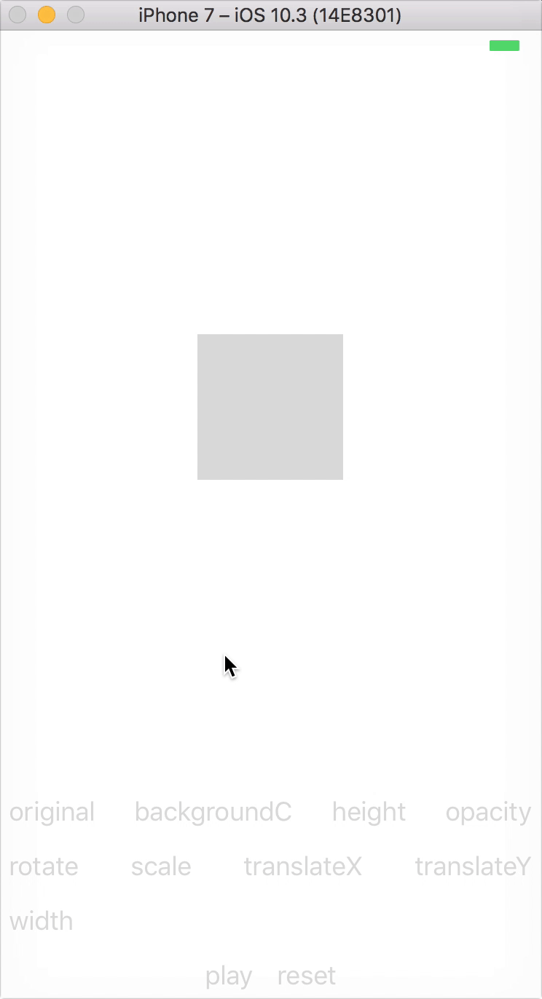

# Haraka

[](https://badge.fury.io/js/haraka)


You define the behavior states of the component, and then animate between them.



## Usage

```js
import Behavior from 'haraka';

box = React.createRef();

<Behavior
  ref={this.box}
  state={[
    { backgroundColor: 'gray' }, // state 0
    { backgroundColor: 'green' }, // state 1
    { opacity: 0.5 }, // state 2
    { rotate: '45deg' } // state 3
  ]}
/>;

// ..

this.box.current.goTo(1); // animates box's backgroundColor from gray to green
this.box.current.goTo(2); // animates the opacity of the -now- green box from 1 to 0.5
this.box.current.goTo(3); // rotates the faded green box 45 degrees, starting from 0

this.box.current.goTo([1, 2, 3]); // plays a sequence of behavior states, colorize then fade then tilt
```

## Install

```bash
yarn add haraka
```

## Definition

```js
type DefaultConfig = { // goTo() default configuration
  type?: 'spring' | 'timing', // default = 'spring', `Animated.spring()` or `Animated.timing()`
  onStart?: func, // to be executed once animation is started, inside `.start()`
  onComplete?: func, // to be executed once animation is completed, inside `.start()`
  ref?: bool, // this will return the animation reference instead of playing it immediately
  // can be useful for animating multiple behaviors with `Animated.sequence()` and `Animated.parallel()`
  // `onStart` and `onComplete `are ignored when `ref` is enabled
  ...AnimatedSpringOptions, // excluding toValue, useNativeDriver (see React Native docs), spring type
  ...AnimatedTimingOptions // excluding toValue, useNativeDriver (see React Native docs), timing type
};

type State = {
  backgroundColor?: string, // default = 'transparent'
  height?: number, // no percentages, default = null
  opacity?: number, // [0, 1], default = 1
  rotate?: string, // e.g. '45deg', default = '0deg'
  scale?: number, // default = 1
  translateX?: number, // default = 0
  translateY?: number, // default = 0
  width?: number // no percentages, default = null
};

type StyleProp = {
  prop: string,
  default: string | number | null,
  native?: bool,
  transform: bool
};

type Behavior = {
  config?: DefaultConfig,
  clearStyleProps?: bool, // removes all default style props on mount and utilizes whatever in `styleProps` only
  state?: State[], // default value is [{}, {}], [{}] can be used for a static behavior
  nativeDriver?: AnimatedValue, // default = new Animated.Value(0), you can use a custom native driver
  driver?: AnimatedValue, // default = new Animated.Value(0), you can use a custom driver
  // nativeDriver prop is used for opacity, rotate, scale and translate (native animations)
  // driver prop is used for backgroundColor, height and width (js animations)
  children?: any, // behavior component can enclose other components or enclose another behavior(s)
  clamp?: bool, // default = false, prevent animations from exceeding their ranges
  keys?: number[], // can be used with custom drivers to define custom state keys/indices
  initialState?: number, // default = 0
  skipProps?: string[], // default = [], allows filtering passed props from being included in styles
  skipStyleProps?: string[], // default = [], allows dropping unused style props
  style?: object, // style of the behavior view, default = {}, AnimatedViewStyle (see React Native docs)
  styleProps?: StyleProp[], // default = [], allows adding any type of style props manually
  unmounted?: bool, // default = false, start behavior in the unmounted state
  // animation presets (they populate `state` prop which will be ignored):
  faded?: bool, // default = false, see below for available presets
  // layout presets (they populate `style` prop):
  absolute?: bool, // default = false, see below for available presets
  centered?: bool, // default = false
  fixed?: bool, // default = false
  full?: bool, // default = false
  landing?: bool, // default = false
};

// animation presets
const presets = {
  faded: [{ opacity: 0 }, { opacity: 1 }]
};

// layout presets, you can use multiple, along with `style` prop, they have a higher priority over it
const layoutPresets = {
  absolute: { bottom: 0, left: 0, position: 'absolute', right: 0, top: 0 },
  centered: { alignSelf: 'center' },
  fixed: { position: 'absolute' },
  full: { flex: 1 },
  landing: { alignItems: 'center', flex: 1, justifyContent: 'center' }
};

// methods
// animate to a specific behavior state
behavior.goTo(index: number | number[], config?: DefaultConfig = {})

behavior.unmount() // useful for removing components that are hidden after animation
behavior.mount(state: ?number) // useful for animations that start in a hidden state
// use along with `unmounted` prop and `mount()`

behavior.key // to retrieve current state key
```

## Examples

Available [here](/examples).
